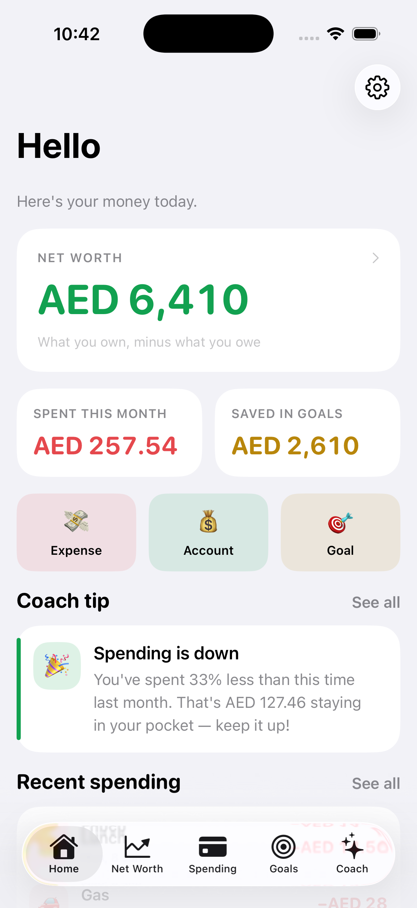

# PennyPath 💸

A clean, simple personal-finance app for iOS — so clear that even a 10-year-old can understand their money. Black-and-white base, with one color per idea:

- 🟢 **Green** = Net Worth
- 🔴 **Red** = Spending
- 🟡 **Gold** = Goals

Built with **SwiftUI + SwiftData**. No accounts, no servers, no tracking — everything lives on the device.

| Home | Net Worth | Spending | Goals | Coach |
|---|---|---|---|---|
|  |  |  |  |  |

## Features

### 🏠 Home
One glance at everything: your net worth, what you spent this month, what you've saved toward goals, a coach tip, and quick-add buttons.

### 🟢 Net Worth
The one honest number: **everything you own minus everything you owe**. Add cash, savings, investments, property (assets) and credit cards or loans (debts). A green/red split bar shows the balance at a glance.

### 🔴 Spending
What you spent **this month**, how it compares to last month (down is good and shown in green), a category breakdown with bars, and a running list grouped by day.

### 🟡 Goals
Save toward things you want — a bike, a trip, a rainy-day fund. Each goal has a gold progress bar, an "X to go" number, and a suggested **monthly amount** to hit your target date. Add or take out money any time.

### ✨ Coach (the "AI")
A friendly money coach that reads your real numbers and writes short, personalized tips: spending trends, your biggest category, end-of-month projections, goal pacing, rainy-day-fund health, and net-worth advice. **It runs entirely on the device** — nothing ever leaves your phone. See [Swapping in a real LLM](#swapping-in-a-real-llm) to upgrade it.

### 🎬 Demo Mode
A switch in **Settings** that fills the app with a rich example world (lots of accounts, three months of spending, a mix of goals) so you can explore every screen or show it off. It's **non-destructive**: Demo Mode runs on a separate in-memory store, so your own data is never touched and comes right back the moment you switch it off. A "Demo data" banner appears on Home whenever it's active.

## Running the app

**Requirements:** Xcode 16+ and an iOS 17+ simulator or device.

1. Open `PennyPath.xcodeproj` in Xcode.
2. Pick an iPhone simulator.
3. Press **Run** (⌘R).

The app fills itself with friendly **sample data** on first launch so it looks alive immediately. You can reload or clear it anytime in **Settings** (the gear on Home).

Or build from the command line:

```bash
xcodebuild -project PennyPath.xcodeproj -scheme PennyPath \
  -destination 'platform=iOS Simulator,name=iPhone 17 Pro' build
```

> To run on a physical device, open the project, select your team under
> **Signing & Capabilities**, and change the bundle identifier if needed.

## How it's built

SwiftUI for the UI, SwiftData for storage. A small shared design system keeps every screen consistent.

```
PennyPath/
├── App/            App entry, 5-tab RootView, AppStore (Demo Mode), sample + demo data
├── Theme/          Colors, fonts, metrics, and reusable components
├── Models/         SwiftData models: Account, Expense, Goal (+ categories)
├── Utilities/      Money formatting, date helpers
└── Features/
    ├── Home/       Dashboard
    ├── NetWorth/   List + add/edit form
    ├── Expenses/   List, breakdown + add/edit form
    ├── Goals/      List, detail (add/remove money) + form
    ├── Coach/      Insights engine + tip cards
    └── Settings/   Currency, sample data, about
```

### Design system
Everything routes through [`Theme.swift`](PennyPath/Theme/Theme.swift): a black-and-white base (adaptive to light/dark mode) plus the three accent colors. Reusable pieces — cards, progress bars/rings, the split bar, emoji badges, chip grids, buttons — live in [`Components.swift`](PennyPath/Theme/Components.swift), so the look stays uniform and easy to change in one place.

### Money & currency
Money formatting lives in [`Money.swift`](PennyPath/Utilities/Money.swift). It defaults to your device's currency and hides empty cents (so you see `$1,200`, not `$1,200.00`). You can switch currency in **Settings**.

## Swapping in a real LLM

The coach is a pure function over your data in
[`InsightsEngine.swift`](PennyPath/Features/Coach/InsightsEngine.swift):

```swift
InsightsEngine.generate(accounts:expenses:goals:) -> [Insight]
```

To use a hosted model (for example the **Claude API**) instead of the on-device rules:

1. Summarize the user's numbers into a short prompt (totals, top categories, goal progress).
2. Call your API and map the response into `[Insight]`.
3. Keep `generate(...)` as the offline fallback when there's no network.

The UI already expects `[Insight]`, so no view code needs to change.

## Privacy
All data is stored locally with SwiftData. There is no analytics, no login, and no network calls. The coach's tips are generated on-device.

## App icon
Generated by [`tools/makeicon.swift`](tools/makeicon.swift) — three growing pill-bars in the app's palette. Regenerate with:

```bash
swift tools/makeicon.swift PennyPath/Assets.xcassets/AppIcon.appiconset/icon-1024.png
```
