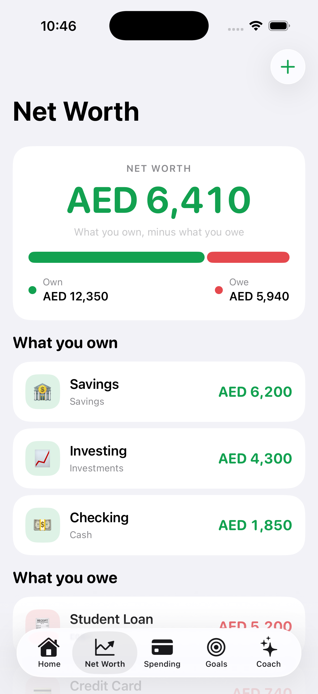
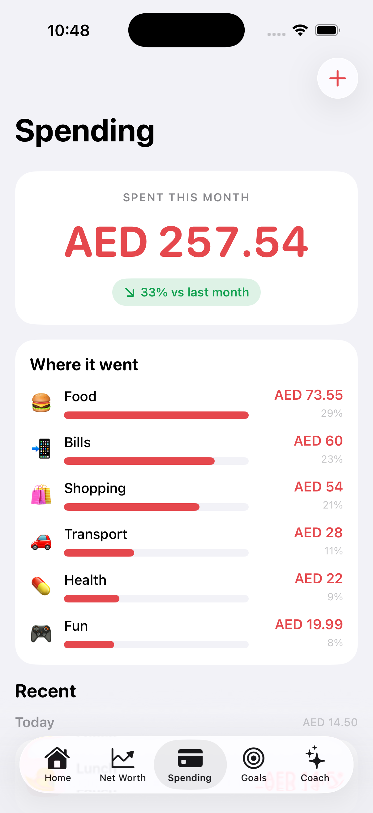
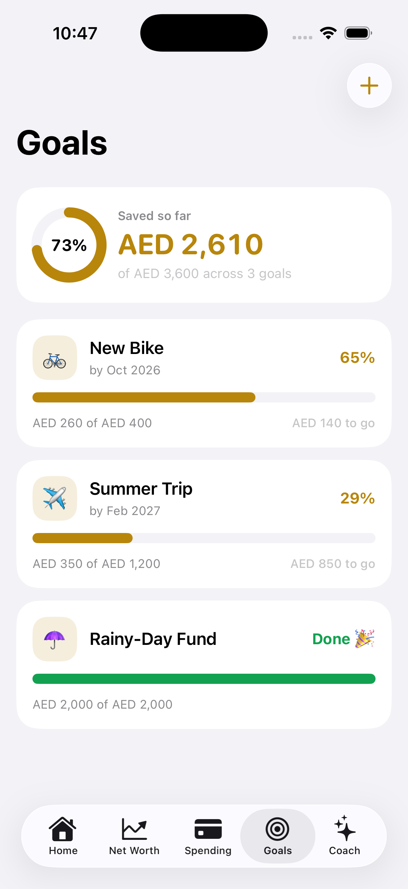
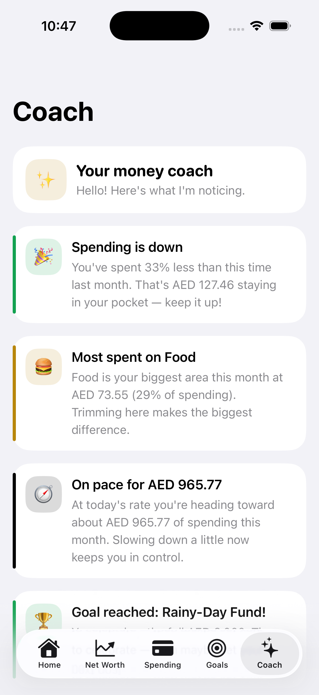

# PennyPath 💸

A clean, simple personal-finance app for iOS — so clear that even a 10-year-old can understand their money. A neutral base with one colour per idea:

- 🟢 **Green** = Net Worth
- 🔴 **Red** = Spending
- 🟡 **Gold** = Goals

The shipping app is the **Spectrum** shell: four tabs — **Net Worth · Expenses · Goals · Insights** (no Home) — with a net-worth deck where every account card wears its own jewel-tone colour.

Built with **SwiftUI + SwiftData**. No accounts, no servers, no tracking — your data lives on the device. The only network use is fetching public market prices (Yahoo Finance) for investment symbols you add and live exchange rates for multi-currency accounts.

| Net Worth | Expenses | Goals | Insights |
|---|---|---|---|
|  |  |  |  |

> _Screenshots predate the Spectrum visual refresh and are due to be regenerated._

## Features

### 🟢 Net Worth
The one honest number: **everything you own minus everything you owe**. Add cash, savings, investments, property (assets) and credit cards or loans (debts) — each as its own colour-coded card in the net-worth deck. Accounts can hold different currencies and are converted to your base currency with live exchange rates.

### 🔴 Expenses
What you spent **this month**, how it compares to last month (down is good and shown in green), a category breakdown with bars, and a running list grouped by day. One unified **add** flow captures a one-off expense or, with the *Repeats* toggle, a recurring upcoming payment.

### 🟡 Goals
Save toward things you want — a bike, a trip, a rainy-day fund. Each goal has a gold progress bar, an "X to go" number, and a suggested **monthly amount** to hit your target date. Add or take out money any time.

### ✨ Insights (the "AI")
A friendly money coach that reads your real numbers and writes short, personalized tips: spending trends, your biggest category, end-of-month projections, goal pacing, rainy-day-fund health, and net-worth advice. **It runs entirely on the device** — your numbers never leave your phone. See [Swapping in a real LLM](#swapping-in-a-real-llm) to upgrade it.

### 🎬 Demo Mode
A switch in **Settings** that fills the app with a rich example world (lots of accounts, three months of spending, a mix of goals) so you can explore every screen or show it off. It's **non-destructive**: Demo Mode runs on a separate in-memory store, so your own data is never touched and comes right back the moment you switch it off. A "Demo data" banner appears in the app whenever it's active.

## Running the app

**Requirements:** Xcode 16+ and an iOS 17+ simulator or device.

1. Open `PennyPath.xcodeproj` in Xcode.
2. Pick an iPhone simulator.
3. Press **Run** (⌘R).

The app fills itself with friendly **sample data** on first launch so it looks alive immediately. You can reload or clear it anytime in **Settings** (the gear in the app).

Or build from the command line:

```bash
xcodebuild -project PennyPath.xcodeproj -scheme PennyPath \
  -destination 'platform=iOS Simulator,name=iPhone 17 Pro' build
```

> To run on a physical device, open the project, select your team under
> **Signing & Capabilities**, and change the bundle identifier if needed.

### Tests

Unit tests live in `PennyPathTests` (insights engine, money/date helpers, goal
pacing, market scoping, seeding guards, snapshot recording):

```bash
xcodebuild -project PennyPath.xcodeproj -scheme PennyPath \
  -destination 'platform=iOS Simulator,name=iPhone 17 Pro' test
```

## How it's built

SwiftUI for the UI, SwiftData for storage. A small shared design system keeps every screen consistent.

```
PennyPath/
├── App/            App entry, RootView (Spectrum shell), AppStore (container + Demo Mode), sample + demo data
├── Theme/          Colors, fonts, metrics, and reusable components
├── Models/         SwiftData models (Account, Expense, Goal, Holding…) + versioned schema & migration plan
├── Services/       Market prices, FX rates, net-worth history, App Store search
├── Utilities/      Money formatting, date helpers
└── Features/
    ├── Spectrum/   The shipping shell: Net Worth · Expenses · Goals · Insights, plus the unified add flow
    ├── NetWorth/   Shared account / holding forms + market search
    ├── Expenses/   Shared expense form
    ├── Goals/      Goal detail (add/remove money) + form
    ├── Coach/      Insights engine (the on-device "AI")
    ├── Onboarding/ First-run welcome
    ├── Shared/     Shared UI (tab bar)
    └── Settings/   Currency, sample data, Developer tools, about
```

### Design system
Everything routes through [`Theme.swift`](PennyPath/Theme/Theme.swift): a neutral base (adaptive to light/dark mode) plus the three accent colours, with the Spectrum net-worth deck giving each account card its own jewel tone. Reusable pieces — cards, progress bars/rings, the split bar, emoji badges, chip grids, buttons — live in [`Components.swift`](PennyPath/Theme/Components.swift), so the look stays uniform and easy to change in one place.

### Money & currency
Money formatting lives in [`Money.swift`](PennyPath/Utilities/Money.swift). It hides empty cents (so you see `$1,200`, not `$1,200.00`). Each account stores its own currency; balances are converted to your base currency with live exchange rates ([`FXRates.swift`](PennyPath/Services/FXRates.swift)). You can change the base currency in **Settings**.

### Data & schema versioning
All data is persisted on-device with SwiftData. The schema is versioned in [`PennyPathSchema.swift`](PennyPath/Models/PennyPathSchema.swift) (`PennyPathSchemaV1`) and the container is built with a `SchemaMigrationPlan`, so future releases can change the model shape without losing what's already on a user's device. The file documents how to add a new version safely — do this for any model change before shipping an update.

## Swapping in a real LLM

The coach is a pure function over your data in
[`InsightsEngine.swift`](PennyPath/Features/Coach/InsightsEngine.swift):

```swift
InsightsEngine.generate(accounts:expenses:goals:) -> [Insight]
```

To use a hosted model (for example the **Claude API**) instead of the on-device rules:

1. Summarize the user's numbers into a short prompt (totals, top categories, goal progress).
2. Call your API and map the response into `[Insight]`.
3. Keep `generate(...)` as the offline fallback when there's no network.

The UI already expects `[Insight]`, so no view code needs to change.

## Privacy
All data is stored locally with SwiftData. There is no analytics, no login, and no network calls. The coach's tips are generated on-device.

## App icon
Generated by [`tools/makeicon.swift`](tools/makeicon.swift) — three growing pill-bars in the app's palette. Regenerate with:

```bash
swift tools/makeicon.swift PennyPath/Assets.xcassets/AppIcon.appiconset/icon-1024.png
```
